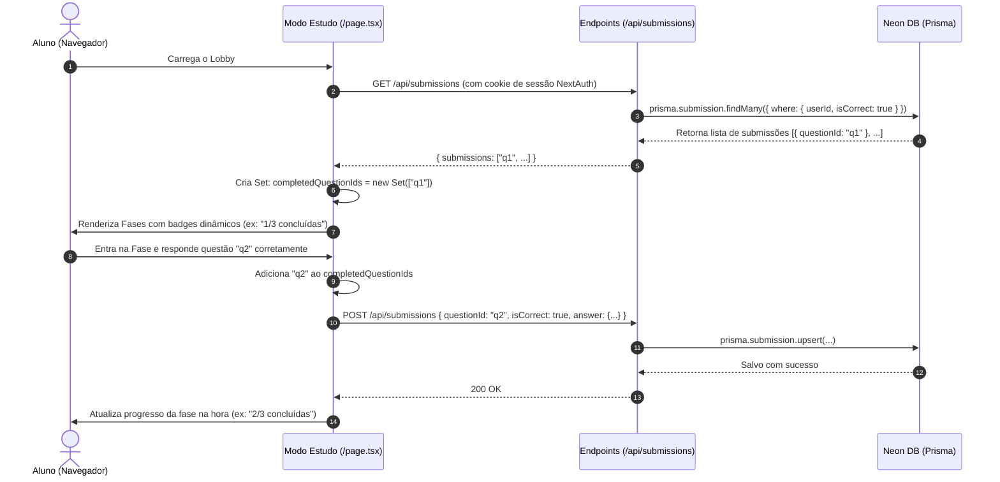

# Persistência de Submissões, Progresso do Aluno e Integridade Referencial

Este documento descreve a arquitetura técnica de persistência de respostas de estudantes, o cálculo de progresso por fase e o mecanismo de garantia de integridade baseado em identificadores únicos universais (UUIDs), implementado na versão 2.3.0 do **Lógica Dinâmica**.

---

## 1. Contexto e Motivação

Nas versões anteriores (1.x e 2.0–2.2), o progresso do aluno era efêmero, residindo exclusivamente em memória ou no `localStorage` do navegador do estudante. Além da perda de dados caso o navegador fosse limpo ou acessado de outro dispositivo, existia uma vulnerabilidade conceitual clássica: **rastreamento por índice posicional**.

### O Problema do Rastreamento por Índice Posicional
Se o progresso de uma fase for associado ao seu índice numérico no array (ex: `fase 0 concluída`):
1. O aluno resolve a Fase 1 ("Introdução à Conjunção", índice 0) e o sistema grava `[0]`.
2. Posteriormente, o professor acessa o `/editor`, exclui a Fase 1 e cria uma nova fase ("Lógica de Predicados Avançada"), posicionando-a no índice 0.
3. Ao recarregar o lobby, o aluno veria a nova fase avançada marcada incorretamente como **"Concluído"**, mesmo sem nunca ter visto suas questões.

---

## 2. Solução Arquitetural: Integridade por UUID e Derivação por Questão

Para resolver essa fragilidade de forma definitiva, o sistema adotou três princípios:

1. **Identificadores Únicos Imutáveis (UUIDs):** Fases e questões possuem IDs únicos gerados criptograficamente (`crypto.randomUUID()` ou `cuid()`). Nenhuma relação de progresso é baseada em posição, ordem ou título.
2. **Submissão Atômica por Questão:** O registro de conclusão reside no menor grão possível: a questão (`questionId`), vinculado ao usuário (`userId`).
3. **Cálculo Derivado em Tempo Real:** O status de "concluído" de uma fase nunca é salvo como uma flag estática. Uma fase é considerada concluída se, e somente se, **todas as suas questões atuais** possuírem submissões corretas registradas pelo aluno no banco de dados.

### Exemplo Prático de Resolução do Cenário:
- Aluno completa a Fase A (`id: "phase-uuid-1"`), que contém as questões `q1` e `q2`.
  - Banco registra: `Submission(userId, questionId="q1")` e `Submission(userId, questionId="q2")`.
- Professor exclui a Fase A e cria a Fase B (`id: "phase-uuid-2"`) com as questões `q3` e `q4`, mantendo-a na mesma posição da tela.
- Quando o aluno carrega a tela:
  - O sistema busca as questões da Fase B: `["q3", "q4"]`.
  - O sistema compara com as submissões do aluno: `["q1", "q2"]`.
  - `["q3", "q4"].every(qId => submissions.has(qId))` resulta em `false`.
  - O cartão da Fase B exibe honestamente: **"0/2 concluídas"**.
  - O aluno não recebe falso positivo.

---

## 3. Modelo de Dados (Prisma & PostgreSQL Neon)

### Tabela `Submission`
A tabela `Submission` no Prisma modela a resposta do aluno com integridade referencial estrita e deleção em cascata (`onDelete: Cascade`):

```prisma
model Submission {
  id         String   @id @default(cuid())
  userId     String
  questionId String
  
  isCorrect  Boolean
  answer     Json     // Snapshot da resposta submetida (ex: {"P": "P", "C": "C"})
  
  user       User     @relation(fields: [userId], references: [id], onDelete: Cascade)
  question   Question @relation(fields: [questionId], references: [id], onDelete: Cascade)

  createdAt  DateTime @default(now())

  @@unique([userId, questionId]) // Garante idempotência: apenas 1 registro ativo por aluno/questão
}
```

### Características Chave do Modelo:
- **`@@unique([userId, questionId])`:** Garante atomicidade e idempotência. Se o aluno refizer a questão, o sistema executa um `upsert`, atualizando a resposta e o timestamp sem duplicar linhas.
- **`onDelete: Cascade` em `Question`:** Se o professor remover uma questão no editor, todas as submissões vinculadas a ela são automaticamente expurgadas do banco, evitando dados órfãos.
- **`answer: Json`:** Armazena o estado estruturado da resposta submetida (seja a valoração da tabela-verdade, a classificação de premissas ou a fórmula de formalização), permitindo auditoria pedagógica futura.

---

## 4. Fluxo de Dados e Ciclo de Vida



---

## 5. Endpoints REST da API

### `GET /api/submissions`
- **Autenticação:** Obrigatória (Sessão NextAuth ativa).
- **Finalidade:** Retornar todas as submissões corretas registradas para o usuário logado.
- **Resposta de Sucesso (`200 OK`):**
  ```json
  {
    "submissions": [
      {
        "id": "sub_cm123abc",
        "questionId": "q_789xyz",
        "isCorrect": true,
        "createdAt": "2026-09-14T02:30:00.000Z"
      }
    ]
  }
  ```

### `POST /api/submissions`
- **Autenticação:** Obrigatória (Sessão NextAuth ativa).
- **Finalidade:** Registrar ou atualizar o resultado de uma questão resolvida pelo aluno.
- **Payload (`Content-Type: application/json`):**
  ```json
  {
    "questionId": "q_789xyz",
    "isCorrect": true,
    "answer": {
      "resposta": "P ∧ Q"
    }
  }
  ```
- **Validações do Endpoint:**
  - Verifica sessão ativa (`session?.user?.id`). Se ausente, retorna `401 Unauthorized`.
  - Valida se `questionId` foi fornecido e se `isCorrect` é booleano. Se inválido, retorna `400 Bad Request`.
  - Realiza `prisma.submission.upsert()` com base na chave composta `userId_questionId`.
- **Resposta de Sucesso (`200 OK`):**
  ```json
  {
    "success": true,
    "submission": {
      "id": "sub_cm123abc",
      "questionId": "q_789xyz",
      "isCorrect": true,
      "updatedAt": "2026-09-14T02:35:00.000Z"
    }
  }
  ```

---

## 6. Interface Visual e Estados de Progresso

No Lobby do Modo Estudo (`src/app/page.tsx`), cada fase calcula seu progresso em tempo de renderização:

```tsx
const questoesFase = fase.questoes || [];
const concluidasCount = questoesFase.filter((q) => completedQuestionIds.has(q.id)).length;
const isConcluida = questoesFase.length > 0 && concluidasCount === questoesFase.length;
```

### Estados do Cartão de Fase:
| Condição | Badge Exibido | Cor do Badge | Ação do Botão |
| :--- | :--- | :--- | :--- |
| Fase sem questões (`questoes.length === 0`) | `Sem questões` | Cinza / Neutro | Desabilitado |
| Nenhuma questão feita (`concluidasCount === 0`) | `0 / N concluídas` | Azul / Primário sutil | "Iniciar Fase" |
| Parcialmente feita (`0 < concluidasCount < N`) | `X / N concluídas` | Âmbar / Warning sutil | "Continuar Fase" |
| Todas questões feitas (`isConcluida === true`) | `Concluído` (com ícone `CheckCircle2`) | Verde / Success | "Praticar Novamente" |

---

## 7. Resiliência Offline e Fallback
Se o aluno estiver utilizando o sistema em ambiente de desenvolvimento sem conexão ao PostgreSQL Neon ou se houver falha de rede transitória:
1. O hook `fetchUserSubmissionsApi()` captura o erro silenciosamente e registra log de aviso no console.
2. O estado local em memória (`completedQuestionIds`) continua garantindo a progressão do quiz durante a sessão ativa.
3. Não há travamento da tela (*crash*) nem bloqueio de navegação para o estudante.
