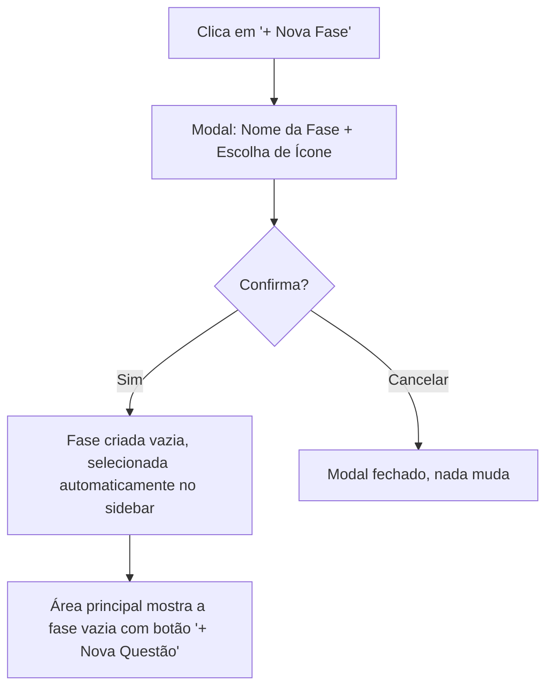
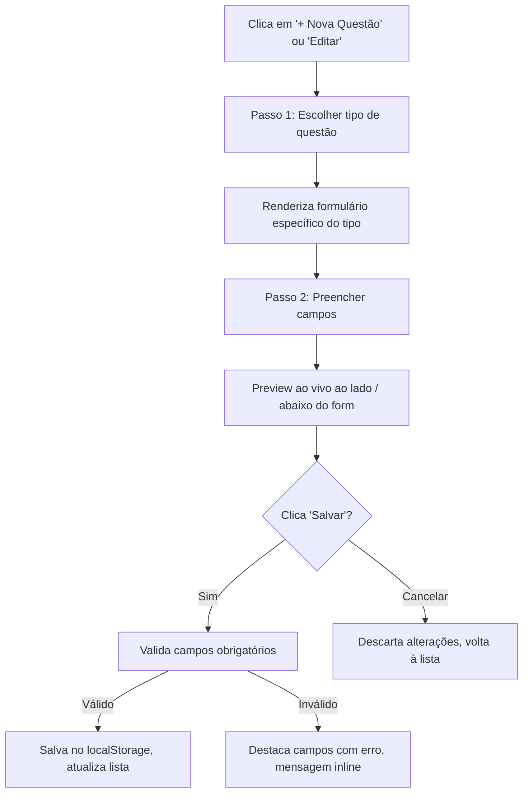
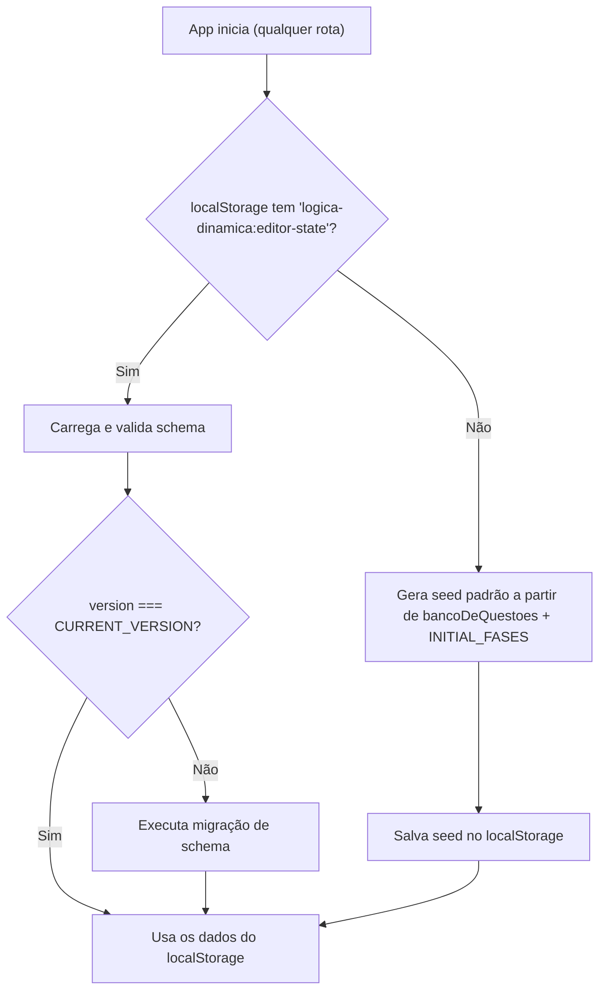

# [SPEC-002] Editor de Conteúdo — Questões e Fases

- **Autor(es):** Equipe Lógica Dinâmica
- **Status:** Implemented / Concluído
- **Data de Criação:** 2026-09-10
- **Última Atualização:** 2026-09-10
- **Target Release / Milestone:** v2.0.0

---

## 1. Contexto & Objetivos

### 1.1 Problema / Motivação

Atualmente, todas as questões e fases do **Lógica Dinâmica** eram definidas estaticamente no código-fonte (`src/data/questions.ts` e constante `INITIAL_FASES` em `page.tsx`). Isso significava que:

1. **Adicionar ou alterar conteúdo exigia alterar código** — inviável para professores sem conhecimento de programação.
2. **A plataforma não podia ser personalizada** — cada curso ou turma teria conteúdo idêntico.
3. **As fases eram rigidamente acopladas ao tipo de questão** — uma fase de "Diagramação" só podia conter questões desse tipo, impedindo fases de revisão mista.

A introdução de um **Editor de Conteúdo** transforma o Lógica Dinâmica de uma demo estática em uma plataforma configurável, onde um professor (ou administrador) monta exercícios e trilhas de estudo sem tocar em código.

### 1.2 Objetivos (Goals)

- [x] Permitir a criação, edição e exclusão de **questões** dos 3 tipos existentes (`diagramacao`, `tabela_verdade`, `formalizacao`) através de uma interface visual.
- [x] Permitir a criação, edição e exclusão de **fases**, com liberdade para incluir questões de tipos diferentes na mesma fase (fases heterogêneas).
- [x] Permitir a **reordenação** de fases e de questões dentro de cada fase via drag-and-drop.
- [x] Persistir toda a configuração em **`localStorage`**, com fallback para os dados padrão (`bancoDeQuestoes`) quando o storage estiver vazio.
- [x] Separar os modos de operação por rota: **`/`** (Modo Estudo) e **`/editor`** (Modo Editor/Admin).
- [x] Oferecer **preview ao vivo** da questão sendo editada, renderizando-a exatamente como o aluno a verá.

### 1.3 Fora de Escopo (Non-Goals)

- **Autenticação e controle de acesso (login/roles):** Não haverá sistema de login nesta versão. A separação entre modos é feita apenas por rota.
- **Backend / Banco de dados remoto:** Toda a persistência é local (`localStorage`). Sincronização em nuvem fica para versão futura.
- **Exportar / Importar JSON:** Planejado como segunda iteração, não faz parte deste MVP.
- **Criação de novos tipos de questão:** O editor suporta apenas os 3 tipos existentes. Novos tipos requerem componentes React dedicados.
- **Sistema de permissões dentro do editor:** Qualquer pessoa que acesse `/editor` tem acesso total.

---

## 2. Experiência do Usuário & Fluxo (UX/UI)

### 2.1 Visão Geral dos Modos

| Aspecto | Modo Estudo (`/`) | Modo Editor (`/editor`) |
| :--- | :--- | :--- |
| **Persona** | Aluno / Estudante | Professor / Admin |
| **Visualização de Fases** | Lista ordenada fixa (sem drag-and-drop) | Grid reordenável via DnD |
| **Interação com Questões** | Apenas responder e validar | Criar, editar, excluir, reordenar |
| **Interação com Fases** | Apenas selecionar e iniciar | Criar, editar, excluir, reordenar |
| **Persistência** | Somente leitura do `localStorage` | Leitura e escrita no `localStorage` |
| **Navegação entre modos** | Link sutil "Modo Editor" no rodapé ou header | Botão "Voltar ao Modo Estudo" no header |

### 2.2 Modo Estudo (`/`) — Mudanças em Relação ao Atual

O Modo Estudo **simplifica** a experiência atual:

1. **Remove o drag-and-drop do Lobby.** As fases aparecem em ordem fixa (definida pelo editor), o aluno apenas clica "Iniciar" ou "Refazer".
2. **Todos os demais comportamentos permanecem idênticos:** barra de progresso, modais de saída, validação, feedback, tela de conclusão de fase.
3. **Os dados vêm do `localStorage`.** Se vazio, carrega o `bancoDeQuestoes` original como seed e cria as 3 fases padrão automaticamente.

### 2.3 Modo Editor (`/editor`) — Layout e Navegação

#### Layout Principal (Desktop ≥ 768px)

```
┌──────────────────────────────────────────────────────────────┐
│  🔧 Editor de Conteúdo                [Voltar ao Modo Estudo]│
├────────────────┬─────────────────────────────────────────────┤
│                │                                             │
│  PAINEL DE     │           ÁREA PRINCIPAL                    │
│  FASES         │                                             │
│  (Sidebar)     │  (Muda conforme seleção no sidebar)         │
│                │                                             │
│  ┌──────────┐  │  ┌───────────────────────────────────────┐  │
│  │ ≡ Fase 1 │◄─┼──│  Editando: "Diagramação"              │  │
│  │   2 quest│  │  │                                       │  │
│  └──────────┘  │  │  Título: [__________________]         │  │
│  ┌──────────┐  │  │  Ícone:  [(Ícone Atual) ▾] (Popover)  │  │
│  │ ≡ Fase 2 │  │  │                                       │  │
│  │   2 quest│  │  │  ─── Questões da Fase ───             │  │
│  └──────────┘  │  │                                       │  │
│  ┌──────────┐  │  │  ┌─────────────────────────────────┐  │  │
│  │ ≡ Fase 3 │  │  │  │ ≡ Q1 — Diagramação              │  │  │
│  │   2 quest│  │  │  │ "Classifique as partes do..."   │  │  │
│  └──────────┘  │  │  │            [Editar] [Excluir]   │  │  │
│                │  │  └─────────────────────────────────┘  │  │
│ [+ Nova Fase]  │  │  ┌─────────────────────────────────┐  │  │
│                │  │  │ ≡ Q2 — Tabela-Verdade            │  │  │
│                │  │  │ "Preencha a coluna final..."     │  │  │
│                │  │  │            [Editar] [Excluir]   │  │  │
│                │  │  └─────────────────────────────────┘  │  │
│                │  │                                       │  │
│                │  │  [+ Nova Questão]                      │  │
│                │  └───────────────────────────────────────┘  │
└────────────────┴─────────────────────────────────────────────┘
```

> **Aprimoramento de UX (Seletor de Ícone Compacto):**
> Para economizar espaço vertical e manter a área de trabalho limpa, a escolha do ícone não ocupa uma grade estática na tela. Em vez disso, ao clicar no botão do ícone ativo em `PhaseEditor`, um **popover flutuante** abre com a lista dos 10 ícones disponíveis (`ICON_OPTIONS`). Ao selecionar um ícone, o estado é atualizado e o popover se fecha automaticamente.

#### Layout Mobile (< 768px)

No mobile, o sidebar colapsa em um seletor horizontal/dropdown compacto no topo da tela. O usuário seleciona a fase desejada, e o conteúdo correspondente ocupa a tela inteira abaixo.

### 2.4 Fluxo: Criar uma Nova Fase



### 2.5 Fluxo: Criar / Editar uma Questão



### 2.6 Formulários por Tipo de Questão

#### Tipo: Diagramação (`diagramacao`)

| Campo | Tipo de Input | Obrigatório | Descrição |
| :--- | :--- | :--- | :--- |
| `enunciado` | `<textarea>` | ✅ | Instrução do exercício |
| `topico` | `<input text>` | ✅ | Tag informativa (ex: "Estrutura de um Argumento") |
| `frases` | Lista dinâmica | ✅ (mín. 2) | Cada frase tem: `texto` (input text) + classificação `P` ou `C` (toggle/radio) |

**Ações na lista de frases:**
- Botão `[+ Adicionar Frase]` — insere nova frase ao final.
- Botão `[🗑]` em cada frase — remove (com confirmação se houver mais de 2 frases).
- Drag handle `[≡]` — reordena frases.

#### Tipo: Tabela-Verdade (`tabela_verdade`)

| Campo | Tipo de Input | Obrigatório | Descrição |
| :--- | :--- | :--- | :--- |
| `enunciado` | `<textarea>` | ✅ | Instrução do exercício |
| `topico` | `<input text>` | ✅ | Tag informativa |
| `variaveis` | Chips / tags input | ✅ (mín. 1) | Nomes das variáveis proposicionais (ex: `P`, `Q`, `R`) |
| `expressao` | `<input text>` com teclado lógico | ✅ | Fórmula a ser avaliada (cabeçalho da última coluna) |
| `linhas` | Tabela editável | ✅ (auto-geradas) | Valores de cada linha para cada variável |
| `resposta_esperada` | Toggle `V`/`F` por linha | ✅ | Resultado esperado para cada combinação |
| `enunciado` | `<textarea>` | Sim | Instrução do exercício |
| `topico` | `<input text>` | Sim | Tag informativa (ex: "Cálculo Proposicional") |
| `expressao` | `<input text>` com barra de atalhos acoplada | Sim | Fórmula proposicional completa (ex: `(P ∨ Q) ∧ (~R)`) |
| `variaveis` | Auto-extraídas pelo parser | Automático | Variáveis atômicas e subexpressões intermediárias |
| `linhas` | Auto-geradas pelo parser | Automático | Estritamente 2^n permutações de valoração booleana |
| `resposta_esperada` | Auto-calculadas pelo parser | Automático | Gabarito de valoração booleana de cada linha |
| `celulas_reveladas` | Toggles interativos na tabela | Opcional | Andaime pedagógico: células ou colunas visíveis como dica para o aluno |

**Comportamento especial:**
- Ao alterar as variáveis, as linhas da tabela devem ser **regeneradas automaticamente** com todas as combinações possíveis de V/F (2^n linhas).
- O professor define apenas a `resposta_esperada` (última coluna).
**Comportamento do Motor Lógico:**
- Ao digitar ou modificar a fórmula, o parser tokeniza, monta a AST, extrai variáveis atômicas e colunas de subexpressões e calcula todas as valorações automaticamente.
- O professor não precisa inserir variáveis manualmente ou calcular linhas; apenas ajusta o andaime pedagógico (`celulas_reveladas`) caso queira fornecer dicas parciais.

#### Tipo: Formalização (`formalizacao`)

| Campo | Tipo de Input | Obrigatório | Descrição |
| :--- | :--- | :--- | :--- |
| `enunciado` | `<textarea>` | ✅ | Sentença em linguagem natural |
| `topico` | `<input text>` | ✅ | Tag informativa |
| `dicas` | Lista dinâmica de inputs | ✅ (mín. 1) | Dicionário de variáveis (ex: `"P: é peculatário"`) |
| `teclado_virtual` | Chips / multi-select | ✅ (mín. 1) | Símbolos disponíveis no teclado virtual do aluno |
| `resposta_esperada` | `<input text>` com teclado lógico | ✅ | Fórmula esperada (validação ignora espaços) |
**Símbolos padrão disponíveis para seleção do teclado virtual no Modo Editor:**
`~`, `∧`, `∨`, `→`, `↔`, `∀`, `∃`.

> [!NOTE]
> **Gestão Automática de Variáveis:** No Modo Editor (`FormalizacaoForm.tsx` e `FormalizacaoArgumentoForm.tsx`), os botões de seleção manual exibem apenas os conectivos lógicos acima. As variáveis e predicados (`[A-Za-z]`) presentes nas fórmulas da resposta esperada são detectados e injetados de forma automática no teclado do aluno, posicionando-se sempre no início da barra de teclas. Variáveis órfãs decorrentes de correções ou exclusão de premissas são removidas automaticamente. Teclas presentes apenas em `dicas` não poluem o teclado.

### 2.7 Preview ao Vivo
### 2.7 Sistema de Guias Estilo Navegador (Editor vs. Visão do Aluno)

À direita do formulário (desktop) ou abaixo (mobile), um painel de preview renderiza a questão **exatamente** como o aluno a verá no Modo Estudo:
O modal de criação e edição de questões (`QuestionFormModal.tsx`) adota um sistema de **guias estilo navegador/IDE**, superando as limitações do antigo layout dividido em duas colunas (50% / 50%):

- Utiliza os mesmos componentes (`Diagramacao.tsx`, `TabelaVerdade.tsx`, `Formalizacao.tsx`).
- O preview recebe os dados do formulário em tempo real via props.
- O preview é **não-interativo** (apenas visual) — exibe o estado inicial da questão, sem permitir resposta.
- Label visual: `"👁 Preview do Aluno"` (usando ícone `Eye` do lucide-react, não emoji).
1. **Guia "Editor" (Ícone `PenLine`):**
   - Ocupa 100% da largura útil do modal.
   - Permite que tabelas-verdade com muitas colunas e linhas respirem com folga, sem quebras forçadas.
   - Possui barra de conectivos lógicos acoplada diretamente ao input de fórmula.

2. **Guia "Visão do Aluno" (Ícone `Eye`):**
   - Ocupa 100% da largura útil do modal.
   - Renderiza o componente `QuestionPreview` interativo, atualizado em tempo real com pulso visual de sincronização.
   - Permite ao professor interagir e resolver o exercício exatamente como o aluno no Modo Estudo (`/`).
   - Garante acesso pleno ao preview também em telas móveis e tablets (onde anteriormente o painel era ocultado via CSS).

---

## 3. Arquitetura Técnica & Modelo de Dados

### 3.1 Novas Rotas (App Router — Next.js)

```
src/app/
├── page.tsx              # Modo Estudo (Lobby + Quiz)  — EXISTENTE, será adaptado
├── editor/
│   └── page.tsx          # Modo Editor                 — NOVO
└── layout.tsx            # Layout compartilhado        — EXISTENTE, sem alteração
```

### 3.2 Modelagem de Dados / Tipos TypeScript

#### Novo tipo: `Phase`

```typescript
// src/types/index.ts

export type LucideIconName =
  | 'Network'
  | 'Table2'
  | 'PenLine'
  | 'BookOpen'
  | 'Brain'
  | 'Target'
  | 'Lightbulb'
  | 'GraduationCap'
  | 'Puzzle'
  | 'FlaskConical';

export interface Phase {
  id: string;           // UUID gerado no momento da criação
  titulo: string;       // Nome da fase (ex: "Diagramação Básica")
  icone: LucideIconName; // Identificador serializável do ícone (string em vez de componente React)
  questoes: Question[]; // Array de questões (pode conter tipos mistos)
}
```

#### Tipos de Questão — Sem Alteração

Os tipos `BaseQuestion`, `DiagramacaoQuestion`, `TabelaVerdadeQuestion`, `FormalizacaoQuestion` e a union type `Question` permanecem inalterados conforme definidos em `src/types/index.ts`.

#### Novo tipo: `EditorState` (Schema do `localStorage`)

```typescript
// src/types/index.ts

export interface EditorState {
  version: number;      // Versionamento do schema para migrações futuras
  phases: Phase[];      // Todas as fases com suas questões embutidas
  updatedAt: string;    // ISO 8601 timestamp da última alteração
}
```

### 3.3 Persistência — `localStorage`

#### Chave de armazenamento
```
localStorage.key = "logica-dinamica:editor-state"
```

#### Schema armazenado (JSON)
```json
{
  "version": 1,
  "updatedAt": "2026-09-10T14:00:00.000Z",
  "phases": [
    {
      "id": "fase-diagramacao",
      "titulo": "Diagramação",
      "icone": "Network",
      "questoes": [
        {
          "id": "q1",
          "tipo": "diagramacao",
          "topico": "Estrutura de um Argumento",
          "enunciado": "Classifique as partes do argumento abaixo:",
          "frases": [
            { "id": "f1", "texto": "Hoje é segunda-feira ou terça-feira." },
            { "id": "f2", "texto": "Hoje não é segunda-feira." },
            { "id": "f3", "texto": "Portanto, hoje é terça-feira." }
          ],
          "resposta_esperada": { "f1": "P", "f2": "P", "f3": "C" }
        }
      ]
    }
  ]
}
```

#### Fluxo de Carregamento (Inicialização)



### 3.4 Módulo de Dados — `src/lib/storage.ts` (NOVO)

Centraliza toda a lógica de leitura/escrita do `localStorage`:

```typescript
// API pública do módulo
export function loadEditorState(): EditorState;      // Lê ou cria seed
export function saveEditorState(state: EditorState): void;  // Persiste
export function resetToDefaults(): EditorState;      // Restaura dados originais

// Helpers para fases
export function createPhase(titulo: string, icone: LucideIconName): Phase;
export function deletePhase(state: EditorState, phaseId: string): EditorState;
export function updatePhase(state: EditorState, phase: Phase): EditorState;
export function reorderPhases(state: EditorState, oldIndex: number, newIndex: number): EditorState;

// Helpers para questões
export function createQuestion(type: QuestionType): Question;  // Cria questão com valores padrão
export function deleteQuestion(state: EditorState, phaseId: string, questionId: string): EditorState;
export function updateQuestion(state: EditorState, phaseId: string, question: Question): EditorState;
export function reorderQuestions(state: EditorState, phaseId: string, oldIndex: number, newIndex: number): EditorState;
```

### 3.5 Mapeamento de Ícones — `src/lib/icons.ts` (NOVO)

Mapeia os nomes serializáveis de ícones (`LucideIconName`) para os componentes React do `lucide-react`:

```typescript
import { Network, Table2, PenLine, BookOpen, Brain, Target, Lightbulb, GraduationCap, Puzzle, FlaskConical } from 'lucide-react';
import type { LucideIcon } from 'lucide-react';
import type { LucideIconName } from '@/types';

export const ICON_MAP: Record<LucideIconName, LucideIcon> = {
  Network,
  Table2,
  PenLine,
  BookOpen,
  Brain,
  Target,
  Lightbulb,
  GraduationCap,
  Puzzle,
  FlaskConical,
};

export const ICON_OPTIONS: { name: LucideIconName; label: string }[] = [
  { name: 'Network', label: 'Rede / Diagramação' },
  { name: 'Table2', label: 'Tabela' },
  { name: 'PenLine', label: 'Escrita / Formalização' },
  { name: 'BookOpen', label: 'Livro' },
  { name: 'Brain', label: 'Cérebro / Raciocínio' },
  { name: 'Target', label: 'Alvo / Objetivo' },
  { name: 'Lightbulb', label: 'Lâmpada / Ideia' },
  { name: 'GraduationCap', label: 'Formatura' },
  { name: 'Puzzle', label: 'Quebra-cabeça' },
  { name: 'FlaskConical', label: 'Laboratório' },
];
```

### 3.6 Estrutura de Componentes — Novos Arquivos

```
src/
├── lib/                          # NOVO — Módulos utilitários
│   ├── storage.ts                # CRUD e persistência do localStorage
│   └── icons.ts                  # Mapeamento de ícones serializáveis
├── components/
│   ├── questions/                # EXISTENTES — sem alteração
│   │   ├── Diagramacao.tsx
│   │   ├── TabelaVerdade.tsx
│   │   └── Formalizacao.tsx
│   ├── ui/                       # EXISTENTES — sem alteração
│   │   ├── Button.tsx
│   │   └── Feedback.tsx
│   └── editor/                   # NOVO — Componentes exclusivos do editor
│       ├── EditorLayout.tsx      # Layout principal (sidebar + área de edição)
│       ├── PhaseSidebar.tsx      # Lista de fases no sidebar com DnD
│       ├── PhaseEditor.tsx       # Formulário de edição de fase (título, ícone)
│       ├── QuestionList.tsx      # Lista de questões da fase selecionada com DnD
│       ├── QuestionCard.tsx      # Card individual de questão na lista
│       ├── QuestionFormModal.tsx # Modal com formulário de criação/edição
│       ├── forms/                # Formulários específicos por tipo
│       │   ├── DiagramacaoForm.tsx
│       │   ├── TabelaVerdadeForm.tsx
│       │   └── FormalizacaoForm.tsx
│       └── QuestionPreview.tsx   # Preview ao vivo usando os componentes de questão existentes
└── app/
    ├── page.tsx                  # MODIFICADO — remove DnD, lê do localStorage
    └── editor/
        └── page.tsx              # NOVO — Página principal do Editor
```

### 3.7 Gerenciamento de Estado

#### Modo Estudo (`/`)

- Lê `EditorState` do `localStorage` via `loadEditorState()` no mount (dentro de `useEffect` para SSR safety).
- Converte `Phase[]` para a estrutura de renderização do Lobby (mapeia `icone` string → componente React via `ICON_MAP`).
- **Remove** toda a lógica de `@dnd-kit` do Lobby (fases em ordem fixa).
- Mantém toda a mecânica de jogo (`playing`, `phase_finished`, validação, feedback).

#### Modo Editor (`/editor`)

- Estado principal: `editorState: EditorState` via `useState`, inicializado por `loadEditorState()`.
- Cada operação CRUD chama os helpers de `storage.ts` e atualiza o estado + `localStorage` simultaneamente.
- `selectedPhaseId: string | null` — controla qual fase está selecionada no sidebar.
- `editingQuestion: Question | null` — controla o modal de edição (null = fechado).
- `isCreating: boolean` — diferencia criação de edição no modal.

---

## 4. Casos de Borda & Tratamento de Erros

### 4.1 Dados e Persistência

| Cenário | Comportamento |
| :--- | :--- |
| `localStorage` vazio (primeiro acesso) | Gera seed a partir de `bancoDeQuestoes`, salva automaticamente |
| `localStorage` com schema incompatível (version mismatch) | Executa migração incremental |
| `localStorage` com JSON corrompido | Exibe alerta "Dados corrompidos. Restaurar padrões?" com opção de reset |
| Navegador em modo privado (storage efêmero) | Funciona normalmente, dados perdem-se ao fechar a aba |
| Quota de storage excedida | Exibe feedback de erro ao salvar: "Não foi possível salvar. Remova algumas questões." |

### 4.2 Validação de Formulários

| Cenário | Comportamento |
| :--- | :--- |
| Enunciado vazio | Campo destacado em vermelho, mensagem "O enunciado é obrigatório" |
| Diagramação com menos de 2 frases | Impede salvamento: "Adicione pelo menos 2 frases" |
| Diagramação sem nenhuma Conclusão (`C`) | Aviso (warning, não bloqueante): "Nenhuma frase marcada como Conclusão" |
| Tabela-Verdade sem variáveis | Impede salvamento: "Adicione pelo menos 1 variável" |
| Tabela-Verdade com resposta_esperada incompleta | Impede salvamento: "Preencha todas as respostas da tabela" |
| Formalização com resposta_esperada vazia | Impede salvamento: "A resposta esperada é obrigatória" |
| Nome de fase vazio | Campo destacado, mensagem "O nome da fase é obrigatório" |
| Nome de fase duplicado | Aviso não-bloqueante: "Já existe uma fase com este nome" |

### 4.3 Exclusão e Confirmação

| Cenário | Comportamento |
| :--- | :--- |
| Excluir questão | Modal de confirmação: "Excluir questão '{enunciado truncado}'?" com botões "Cancelar" / "Excluir" |
| Excluir fase com questões | Modal de confirmação: "A fase '{titulo}' contém {n} questão(ões). Excluir tudo?" |
| Excluir fase vazia | Modal simplificado sem aviso de questões |
| Excluir a última fase restante | Impedir: "Deve existir pelo menos 1 fase" |

### 4.4 UX / Interação

| Cenário | Comportamento |
| :--- | :--- |
| Navegar para `/` sem nenhuma fase/questão no storage | Tela de estado vazio: "Nenhuma fase disponível. Acesse o Editor para criar conteúdo." |
| Fase sem questões no Modo Estudo | Card aparece no lobby mas com botão desabilitado: "Sem questões" |
| Redimensionamento de tela no Editor | Sidebar colapsa/expande responsivamente |
| Formulário com alterações não salvas + tentativa de fechar | Modal de confirmação: "Descartar alterações?" |

---

## 5. Critérios de Aceite & Estratégia de Testes

### 5.1 Critérios de Aceite (Given / When / Then)

#### Modo Estudo

- **Cenário 1: Lobby exibe fases do localStorage**
  - **Dado** que o `localStorage` contém 3 fases com questões,
  - **Quando** o aluno acessa `/`,
  - **Então** o Lobby exibe 3 cards de fase em ordem fixa, sem handles de arrastar.

- **Cenário 2: Seed automático no primeiro acesso**
  - **Dado** que o `localStorage` está vazio,
  - **Quando** o aluno acessa `/`,
  - **Então** as 3 fases padrão são geradas e exibidas automaticamente.

- **Cenário 3: Fase sem questões**
  - **Dado** que uma fase no `localStorage` não contém questões,
  - **Quando** o aluno visualiza o Lobby,
  - **Então** o card da fase aparece com botão desabilitado "Sem questões".

#### Editor — Fases

- **Cenário 4: Criar nova fase**
  - **Dado** que o professor está em `/editor`,
  - **Quando** ele clica em "+ Nova Fase", preenche o título e seleciona um ícone,
  - **Então** a fase aparece no sidebar e no `localStorage`.

- **Cenário 5: Editar nome e ícone de fase**
  - **Dado** que uma fase está selecionada no sidebar,
  - **Quando** o professor altera o título e o ícone na área principal,
  - **Então** as mudanças refletem imediatamente no sidebar e são persistidas.

- **Cenário 6: Excluir fase com confirmação**
  - **Dado** que uma fase com 2 questões está selecionada,
  - **Quando** o professor clica em "Excluir Fase",
  - **Então** um modal de confirmação exibe a quantidade de questões que serão perdidas.

- **Cenário 7: Reordenar fases via DnD**
  - **Dado** que existem 3 fases no sidebar,
  - **Quando** o professor arrasta a Fase 3 para a posição 1,
  - **Então** a nova ordem é persistida e refletida no Modo Estudo.

#### Editor — Questões

- **Cenário 8: Criar questão de Diagramação**
  - **Dado** que o professor está editando uma fase,
  - **Quando** ele clica em "+ Nova Questão", seleciona "Diagramação", preenche enunciado, 3 frases com classificações P/C,
  - **Então** a questão aparece na lista da fase e o preview ao vivo mostra a renderização correta.

- **Cenário 9: Criar questão de Tabela-Verdade com auto-geração**
  - **Dado** que o professor está criando uma questão de Tabela-Verdade,
  - **Quando** ele insere as variáveis `P` e `Q`,
  - **Então** 4 linhas são geradas automaticamente com todas as combinações de V/F.

- **Cenário 10: Editar questão existente**
  - **Dado** que uma questão existe na lista,
  - **Quando** o professor clica em "Editar" e altera o enunciado,
  - **Então** a mudança aparece no preview e é persistida ao salvar.

- **Cenário 11: Validação de formulário**
  - **Dado** que o professor está criando uma questão de Formalização,
  - **Quando** ele tenta salvar com o campo "resposta esperada" vazio,
  - **Então** o formulário impede o envio e destaca o campo com mensagem de erro.

- **Cenário 12: Reordenar questões dentro de uma fase**
  - **Dado** que uma fase contém 3 questões,
  - **Quando** o professor arrasta a questão 3 para a posição 1,
  - **Então** a nova ordem é persistida e respeitada no Modo Estudo.

### 5.2 Plano de Testes Automatizados

- **Testes Unitários (`src/lib/__tests__/storage.test.ts`):**
  - `loadEditorState()` retorna seed quando localStorage vazio.
  - `createPhase()` gera UUID e valores padrão corretos.
  - `deletePhase()` remove a fase e suas questões.
  - `updateQuestion()` atualiza apenas a questão alvo.
  - `reorderPhases()` e `reorderQuestions()` produzem a ordem correta.
  - Migração de schema funciona entre versões.

- **Testes de Integração (`src/__tests__/Editor.test.tsx`):**
  - Renderizar `/editor` e verificar que o sidebar exibe as fases do storage.
  - Simular criação de fase e verificar persistência no localStorage mock.
  - Simular criação de questão de cada tipo e verificar validação de campos obrigatórios.
  - Verificar que o preview renderiza corretamente ao preencher o formulário.

- **Testes de Integração (`src/__tests__/Lobby.test.tsx`):**
  - Adaptados para considerar que os dados vêm do localStorage.
  - Teste de seed automático e fallback.
  - Remoção de testes de DnD do lobby (agora exclusivo do editor).

> **Resultado da Execução:** 3 suítes de teste (`storage.test.ts`, `Editor.test.tsx`, `Lobby.test.tsx`), **78 testes passando (100%)**.

---

## 6. Dependências & Considerações de Rollout

### 6.1 Dependências Existentes (Sem Novas Instalações)

Todas as bibliotecas necessárias já estão no projeto:

- `@dnd-kit/core`, `@dnd-kit/sortable`, `@dnd-kit/modifiers` — Para DnD no editor.
- `lucide-react` — Para seleção de ícones.
- `next` (App Router) — Para a nova rota `/editor`.
- `jest`, `@testing-library/react` — Para os novos testes.

### 6.2 Riscos e Mitigações

| Risco | Mitigação |
| :--- | :--- |
| Limite de 5-10MB do `localStorage` | Para um banco de ~100 questões, o JSON gira em torno de 50KB. Risco desprezível no MVP. |
| Perda de dados ao limpar cache do navegador | Informar o professor com um banner sutil no editor. Exportar/Importar JSON na próxima iteração. |
| Quebra de testes existentes ao alterar `page.tsx` | Atualizar `Lobby.test.tsx` incrementalmente junto com cada mudança. |
| SSR e `localStorage` | Toda leitura de `localStorage` deve ocorrer dentro de `useEffect` ou `typeof window !== 'undefined'` para evitar erros de hidratação no Next.js. |

### 6.3 Ordem de Implementação Sugerida

1. **Tipos e Storage** — `types/index.ts` + `lib/storage.ts` + `lib/icons.ts` + testes unitários.
2. **Adaptar Modo Estudo** — Refatorar `page.tsx` para ler do localStorage, remover DnD do lobby.
3. **Editor — Estrutura** — Rota `/editor/page.tsx` + `EditorLayout` + `PhaseSidebar`.
4. **Editor — CRUD Fases** — Criar, editar, excluir, reordenar fases.
5. **Editor — CRUD Questões** — Formulários por tipo + preview + validação.
6. **Testes de Integração** — `Editor.test.tsx` + atualizar `Lobby.test.tsx`.
7. **Polish & Edge Cases** — Estados vazios, confirmações, responsividade mobile.

